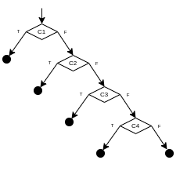
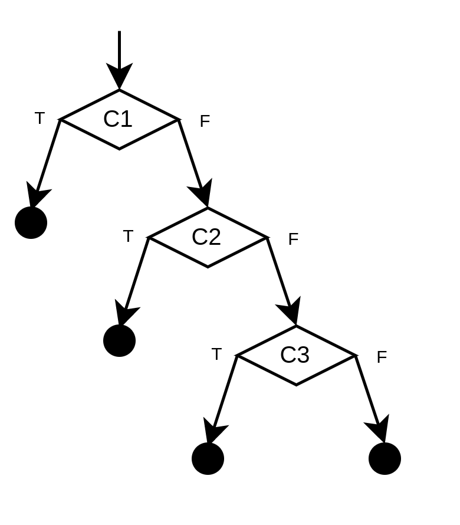

# Taller 3

## Ejercicio 1

Obtuvimos los siguientes resultados:

- a) sat
- b) sat
- c) sat

Para el punto c nos devolvió que es verdadero en el modelo `x = false` y `y =
true`.


## Ejercicio 2

Obtuvimos los siguientes resultados:

- a) sat con `x = 12` e `y = 0`
- b) sat con `x = 1` e `y = 12`
- c) sat con `x = 1` e `y = 64`


## Ejercicio 3

El output de Z3 que obtuvimos fue el siguiente:

```smt
sat
(model 
  (define-fun a2 () Real
    4.0)
  (define-fun a1 () Real
    0.0)
  (define-fun a3 () Real
    1.0)
)
```

La interpretación es que una forma de que la especificación sea satisfacible es
que ocurra que `a1 = 0`, `a2 = 4` e `a3 = 1`. Cómo en este caso las expresiones
tienen una única solución estos a su vez son los resultados de calcular las
expresiones.


## Ejercicio 4

### a)

| Iteración | Input Concreto      | Condición de Ruta         | Especificación para Z3                  | Resultado Z3         |
| --------- | ------------------- | ------------------------- | --------------------------------------- | -------------------- |
| 1         | a=0, b=0, c=0       | C1                        | (not Z1)                                | a0=1, b0=1, c0=1     |
| 2         | a=1, b=1, c=1       | !C1 && !C2 && C3          | (and (not Z1) (not Z2) (not Z3))        | a0=2, b0=3, c0=4     |
| 3         | a=2, b=3, c=4       | !C1 && !C2 && !C3 && !C4  | (and (not Z1) (not Z2) (not Z3) Z4)     | a0=2, b0=1, c0=2     |
| 4         | a=2, b=1, c=2       | !C1 && !C2 && !C3 && C4   | (and (not Z1) Z2)                       | a0=1, b0=1, c0=2     |
| 5         | a=1, b=1, c=2       | !C1 && C2                 | END                                     | END                  |

Donde:

C1 =  `a <= 0 || b <= 0 || c <= 0`
C2 = `! (a + b > c && a + c > b && b + c > a)`
C3 = `a == b && b == c`
C4 = `a == b || b == c || a == c`

Z1 = `(or (<= a 0) (<= b 0) (<= c 0))`
Z2 = `(not (and (> (+ a b) c) (> (+ a c) b) (> (+ b c) a)))`
Z3 = `(and (= a b) (= b c))`
Z4 = `(or (= a b) (= b c) (= a c))`

### b)

Como ejeuta al menos una vez en true y en false cada if decimos que tiene un 100% de branch coverage.


### c)




## Ejercicio 5


### a)

| Iteración | Input Concreto      | Condición de Ruta         | Especificación para Z3                  | Resultado Z3         |
| --------- | ------------------- | ------------------------- | --------------------------------------- | -------------------- |
| 1         | k=0.0               | !C1 && !C2 && !C3         | (and (not Z1) (not Z2) Z3)              | k0=-3.0              |
| 2         | k=-3.0              | !C1 && !C2 && C3          | (and (not Z1) Z2)                       | k0=-1.0              |
| 3         | k=-1.0              | !C1 && C2 && !C3          | (and (not Z1) Z2 Z3)                    | unsat                |
| -         | -                   | -                         | (and Z1)                                | k0=-5.0              |
| 4         | k=-5.0              | C1 && !C2 && !C3          | (and Z1 (not Z2) Z3)                    | unsat                |
| -         | -                   | -                         | (and Z1 Z2)                             | unsat                |
| -         | -                   | -                         | END                                     | END                  |

Donde:

C1 = `5.0 + k == 0`
C2 = `1.0 + k == 0`
C3 = `3.0 + k == 0`

Z1 = `(= (+ 5.0 k) 0.0)`
Z2 = `(= (+ 1.0 k) 0.0)`
Z3 = `(= (+ 3.0 k) 0.0)`


### b)

Como ejeuta al menos una vez en true y en false cada if decimos que tiene un 100% de branch coverage.


### c)




