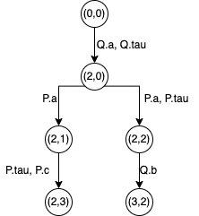

# Taller 5 

## Ejercicio 2

P y Q son debilmente bisimilares ya que el defensor tiene siempre una estrategia de defensa siguiendo la siguiente relacion de bisimulación:

[(0,0), (1,2), (2,3), (3,1), (4,2)]

## Ejercicio 3

